# Api REST con SprinBoot
## Requisitos

Para poder ejecutar este proyecto, necesitarás tener instalado lo siguiente:

- Java Development Kit (JDK) 17
- Maven 3.3.0
- Spring Boot

Asegúrate de tener estas herramientas instaladas y configuradas correctamente antes de intentar ejecutar el proyecto.

## Docker
```bash
docker compose up -d --build
```
## Demostracion con Maker

```diff
http://localhost:8080/api/maker/findAll
```
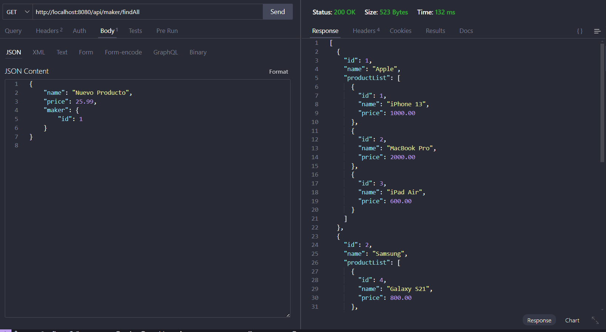

```diff
http://localhost:8080/api/maker/find/2
```
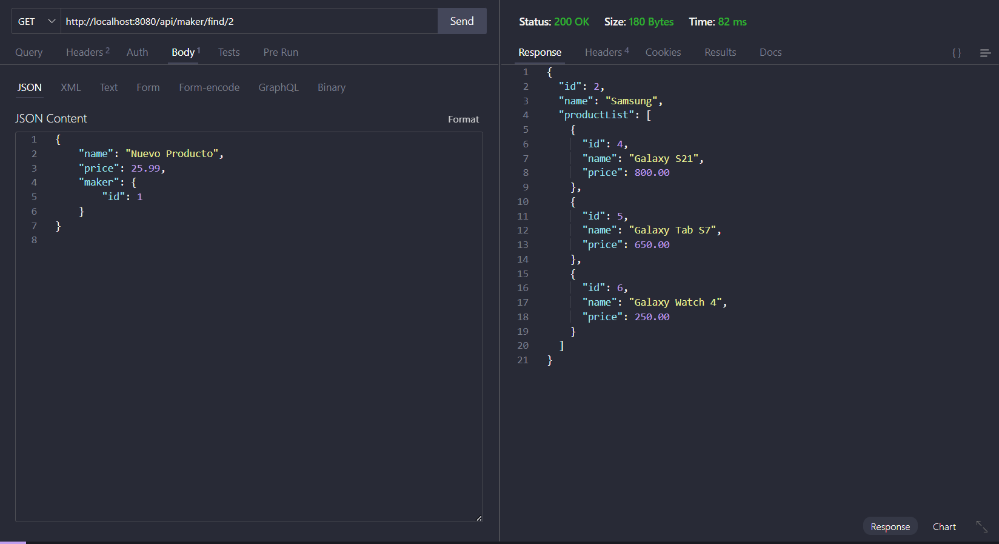

```diff
http://localhost:8080/api/maker/save
```
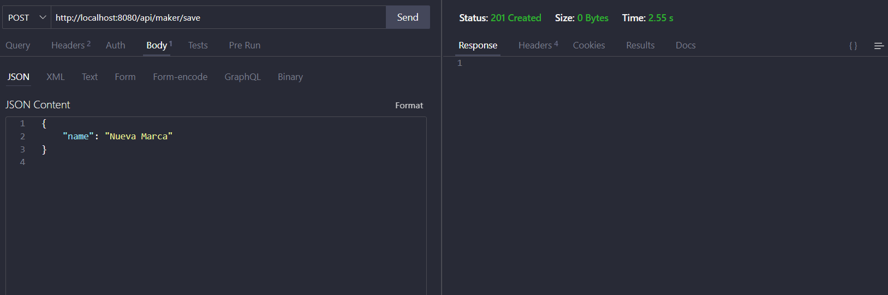
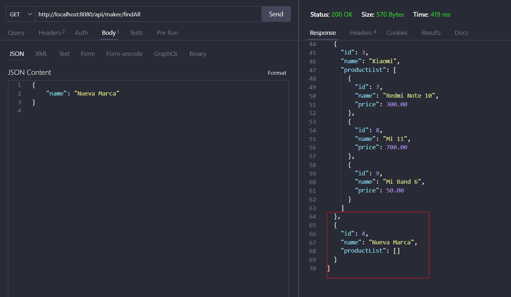

```diff
http://localhost:8080/api/update/4
```
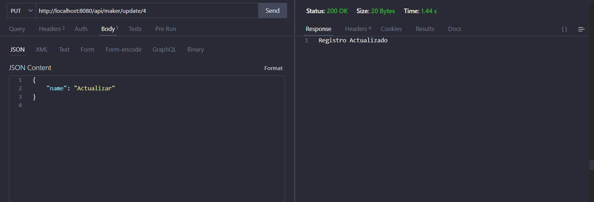
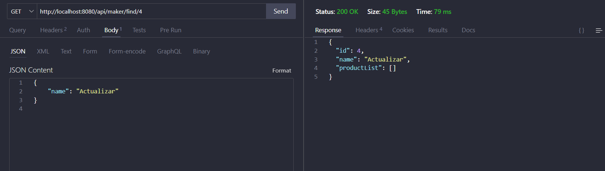

```diff
http://localhost:8080/api/Delete/4
```
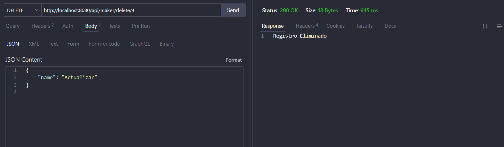
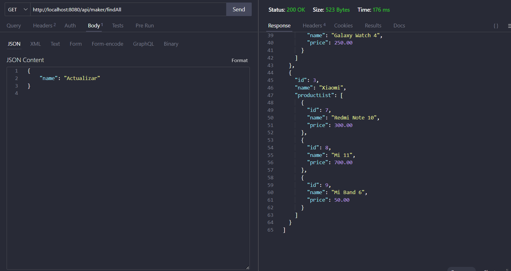

## Demostracion con Product
```diff
http://localhost:8080/api/product/findAll
```
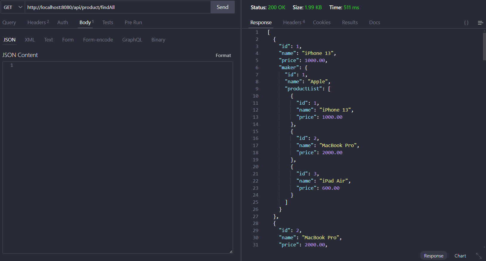

```diff
http://localhost:8080/api/product/find/7
```
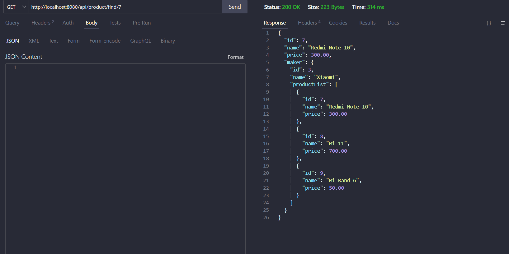

```diff
http://localhost:8080/api/product/save
```
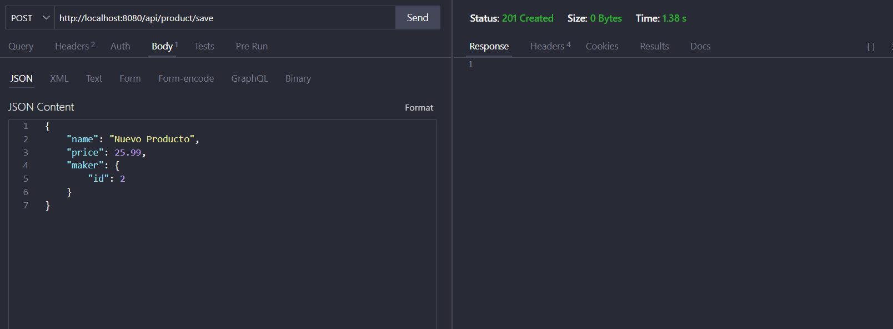
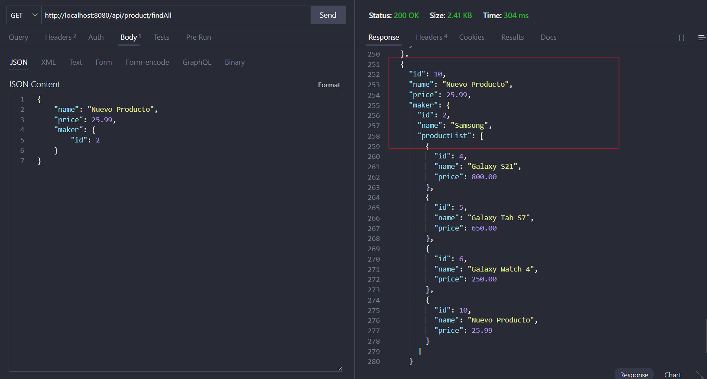

```diff
http://localhost:8080/api/product/update/10
```
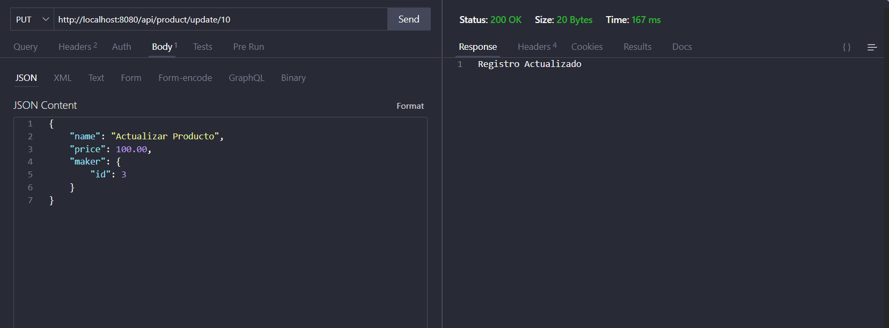
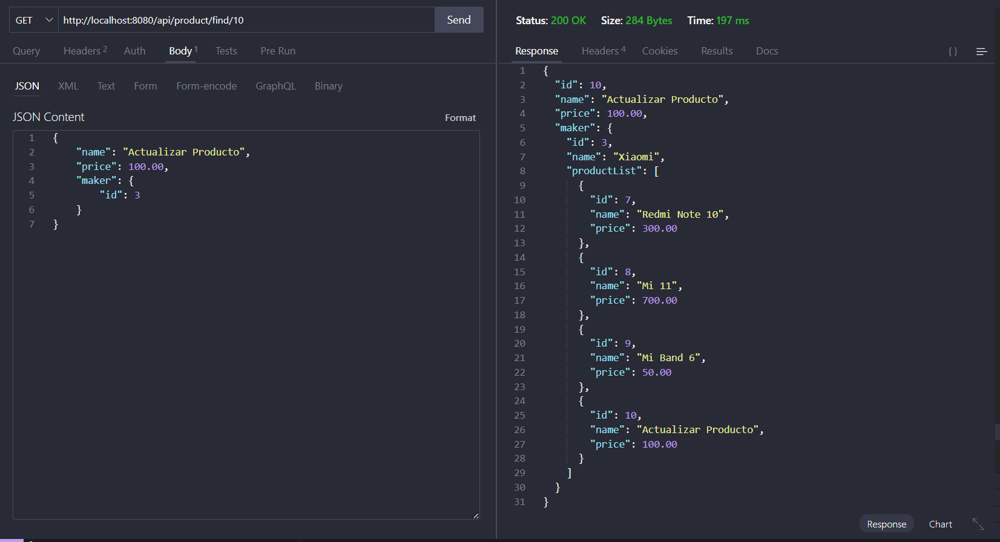

```diff
http://localhost:8080/api/product/delete/10
```
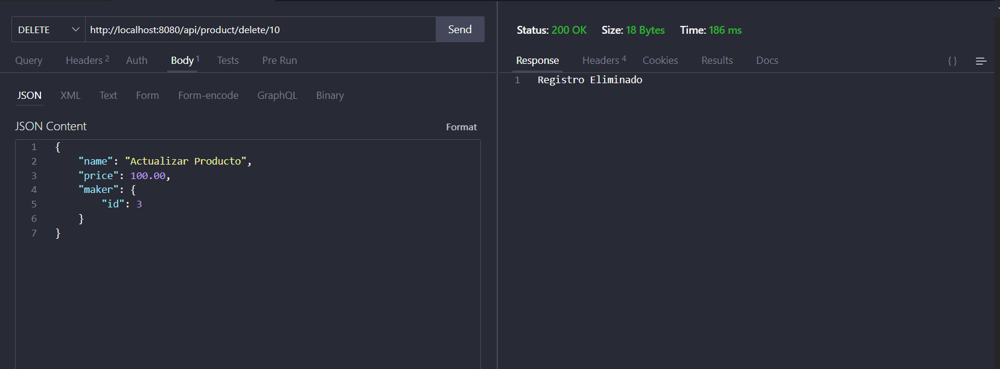
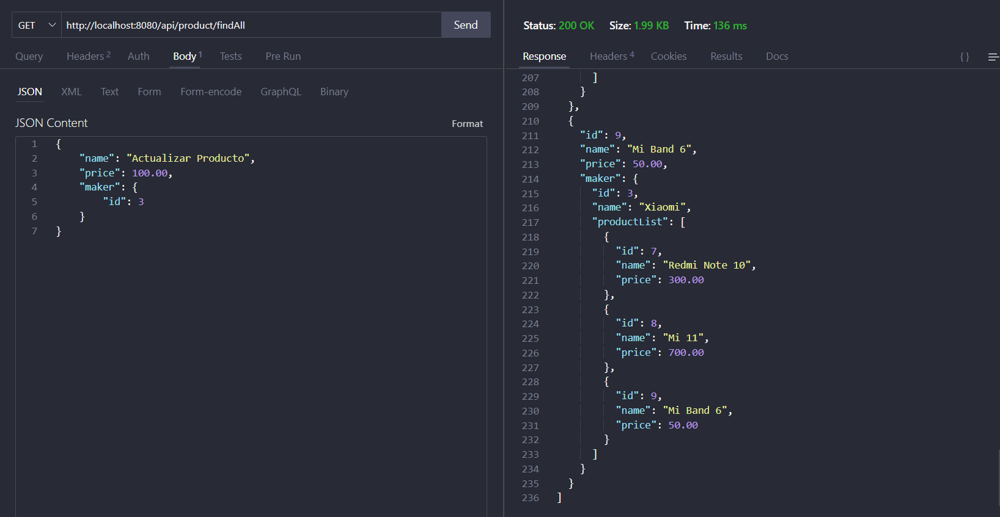